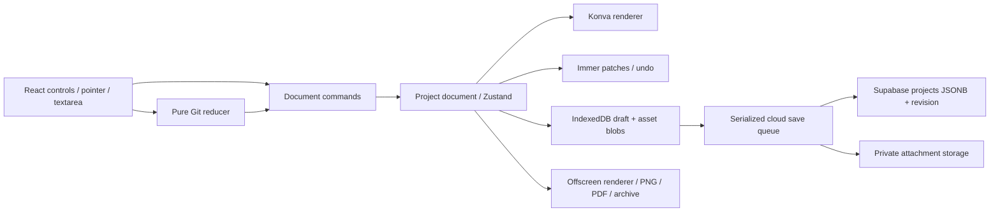

# 02 — Architecture และ data contracts

เอกสารนี้เป็นแหล่งหลักของชื่อ field, types, defaults และขอบเขตโมดูล อ่านร่วมกับ [ADR 0002](../adr/0002-custom-canvas-and-document-model.md), [Git types](04-git-simulator.md) และ [persistence protocol](05-persistence-security-and-export.md)

ตัวอย่าง TypeScript/JSON เป็นสเปกสำหรับสร้าง implementation และ fixtures ใน M1 ไม่ใช่โค้ดแอปที่ติดตั้งแล้ว

## 1. โครงสร้างระบบ



Next.js จัด routing, authenticated shell และ SSR auth cookie ส่วน editor, IndexedDB, Konva และ export ทำฝั่ง client ใช้ dynamic import ภายใน client boundary โดยปิด SSR ของ editor renderer

Pure domain layer ต้องไม่ import React, Konva, Supabase, DOM หรือ Zustand ทำให้ทดสอบ state transition ได้โดยไม่เปิด browser

### โครงสร้างโค้ดเป้าหมาย

```text
src/
  app/                       # login, projects, editor shell (server identity guard)
  proxy.ts                   # Next 16 proxy: Supabase cookie refresh only
  features/auth/             # owner login form (no sign-up)
  features/projects/         # dashboard
  features/editor/           # UI orchestration, session/store, panels, export dialog
  features/canvas/           # renderer, gestures, transforms, DOM text/Git overlays, shared node views
  features/git-simulator/    # widget view + layout, board file draft, DOM panel, session store (reducer lives in domain/git)
  domain/document/           # schema, commands, history, geometry/transform, remap, limits
  domain/git/                # Git types, pure reducer, selectors, messages
  services/persistence/      # IndexedDB, save coordinator, reconcile, deletion, Supabase adapters
  services/projects/         # local (development) and cloud project services
  services/assets/           # image ingest/validation
  services/export/           # PNG/PDF renderer, archive worker/import
  lib/supabase/              # browser/server clients and config guard
supabase/
  migrations/                # SQL: tables, RLS, grants, bucket, RPCs
  tests/database/            # pgTAP tests
tests/
  fixtures/                  # versioned document/Git fixtures
  db-shim/                   # Supabase role/auth/storage shim for plain PostgreSQL
  e2e/  integration/  perf/
```

ใช้ pnpm พร้อม lockfile และ Node LTS ที่ Next.js stable รุ่นที่เลือกใน M1 รองรับ เลือก stable ที่ peer dependencies เข้ากันในครั้งเดียว บันทึกเวอร์ชันจริงและเหตุผลใน delivery แล้ว pin lockfile ไม่อัปเกรด major ระหว่าง milestone โดยไม่มีเหตุผล

## 2. Canonical document types

ใช้ UUID จาก `crypto.randomUUID()` สำหรับ project/slide/node/asset IDs ที่ application boundary; pure reducer รับ IDs ที่สร้างแล้ว Git commit IDs เป็น C1/C2 ภายใน widget ตาม [Git spec](04-git-simulator.md)

```ts
type ProjectId = string;
type SlideId = string;
type NodeId = string;
type AssetId = string;
type Color = string; // normalized #RRGGBB; fill เพิ่ม literal 'transparent'
type Point = { x: number; y: number };
type Rect = { x: number; y: number; width: number; height: number };
type Bounds = Rect;
type StrokeStyle = {
  stroke: Color;
  strokeWidth: number;
  strokeStyle: 'solid' | 'dashed';
};

interface NodeBase {
  id: NodeId;
  x: number;
  y: number;
  rotation: number; // degrees; rotate about local origin then translate x,y
  opacity: number;
  locked: boolean;
}

type RectNode = NodeBase & StrokeStyle & {
  type: 'rectangle'; width: number; height: number;
  fill: Color | 'transparent';
};
type EllipseNode = NodeBase & StrokeStyle & {
  type: 'ellipse'; width: number; height: number;
  fill: Color | 'transparent';
};
type LineNode = NodeBase & StrokeStyle & {
  type: 'line'; points: [Point, Point];
};
type ArrowNode = NodeBase & StrokeStyle & {
  type: 'arrow'; points: [Point, Point];
  headLength: number; headWidth: number;
};
type FreehandNode = NodeBase & StrokeStyle & {
  type: 'pen' | 'highlighter'; points: Point[];
};
type TextNode = NodeBase & {
  type: 'text'; text: string; width: number;
  fontFamily: 'Noto Sans Thai'; fontSize: number;
  lineHeight: number; color: Color;
  align: 'left' | 'center' | 'right';
};
type ImageNode = NodeBase & {
  type: 'image'; assetId: AssetId; width: number; height: number;
};
type GitSimulatorNode = NodeBase & {
  type: 'git-simulator'; rotation: 0; scale: number;
  view?: 'local' | 'remote' | 'full'; // lesson step shown; missing = 'full' (plan04 §5)
  state: GitSimulationState; // exact type owned by 04-git-simulator.md
};
type CanvasNode = RectNode | EllipseNode | LineNode | ArrowNode
  | FreehandNode | TextNode | ImageNode | GitSimulatorNode;

interface SlideDocument {
  id: SlideId;
  name: string;
  background: Color;
  nodes: CanvasNode[]; // back to front; no duplicate numeric zIndex
}
interface AssetReference {
  id: AssetId;
  mimeType: 'image/png' | 'image/jpeg' | 'image/webp';
  width: number;
  height: number;
  byteLength: number;
  sha256: string; // hex digest of source bytes, no credentials
  storagePath: string; // deterministic relative path; may not yet be uploaded
}
interface ProjectDocument {
  schemaVersion: 1;
  slides: SlideDocument[]; // presentation order
  assets: Record<AssetId, AssetReference>;
}
interface ProjectContent {
  title: string;
  document: ProjectDocument;
}
interface ProjectRecord extends ProjectContent {
  id: ProjectId;
  ownerId: string;
  revision: number;
  lastMutationId: string | null;
  createdAt: string; // server ISO timestamp
  updatedAt: string;
  deletedAt: string | null;
}
type ProjectSummary = Pick<ProjectRecord,
  'id' | 'ownerId' | 'title' | 'revision' | 'updatedAt' | 'createdAt'>;
type ArchiveDocument = Omit<ProjectDocument, 'assets'> & {
  assets: Record<AssetId, Omit<AssetReference, 'storagePath'>>;
};
interface ArchiveManifest {
  format: 'learning-suit';
  formatVersion: 1;
  documentSchemaVersion: 1;
  title: string;
  exportedAt: string;
  assets: { id: AssetId; path: string }[];
}
interface ProjectArchive {
  manifest: ArchiveManifest;
  document: ArchiveDocument;
  blobs: Map<AssetId, Blob>; // runtime result; actual ZIP stores binary entries
}
```

`GitSimulationState` เป็น type import จากโมดูล Git; ห้ามสร้าง copy ของ type นี้ที่ renderer/export

### Geometry invariants

- local point `(u,v)` แปลงเป็น world โดย `R(rotation) * (u,v) + (x,y)` ใช้ radians เฉพาะคำนวณ
- Rect/Image ใช้มุมซ้ายบน local `(0,0)`; Ellipse ใช้กรอบ local `(0,0,width,height)` และวาดจุดศูนย์กลาง `(width/2,height/2)`
- Path local points เป็น coordinates ของเส้น เก็บเป็นตัวเลข finite; normalize origin ตอนสร้าง แต่ไม่ reorder จุด start/end ของลูกศร
- ไม่มี `scaleX/scaleY` ถาวรสำหรับ node ทั่วไป เมื่อ transform จบให้เขียนกลับ width/height/points/fontSize ตามชนิดแล้ว reset Konva transform
- Git widget มี base 1120×680 (ขั้น 1–2) หรือ 1600×680 (ขั้น 3 / เอกสารเก่าที่ไม่มี `view`) ตาม `gitBaseSize(view)` ใน domain และ `scale` แบบ uniform ไม่มี rotation
- Stroke width และ arrow head dimensions เป็น world units ไม่ขึ้นกับ camera; resize วัตถุไม่เปลี่ยนความหนาเส้น
- Text height คำนวณจาก width/font/text/lineHeight ไม่เก็บ height อีกชุดหนึ่ง; self-host Noto Sans Thai ให้ measure และ export ตรงกัน
- Multi-selection รองรับ uniform scale/rotate เท่านั้น เพื่อไม่สร้าง skew ที่ model นี้แสดงไม่ได้

## 3. Session, transient state และ recovery

```ts
interface Camera { x: number; y: number; zoom: number }
type Tool = 'select' | 'hand' | 'pen' | 'highlighter' | 'rectangle'
  | 'ellipse' | 'line' | 'arrow' | 'text' | 'image' | 'eraser';
interface EditorSession {
  activeSlideId: SlideId;
  cameras: Record<SlideId, Camera>;
  selectedNodeIds: NodeId[];
  tool: Tool;
  keepDrawing: boolean;
  rightPanel: 'properties' | 'objects' | 'git' | null;
  teachingMode: boolean;
}
type PendingEdit =
  | { kind: 'text'; slideId: SlideId; nodeId: NodeId;
      before: TextNode | null; draft: TextNode }
  | { kind: 'git-file'; slideId: SlideId; nodeId: NodeId;
      machine: 'A' | 'B'; before: FileSnapshot; draft: FileSnapshot };
interface LocalDraft {
  localVersion: 1;
  ownerId: string;
  projectId: ProjectId;
  content: ProjectContent;
  baseRevision: number | null; // null = not yet published; reservation may exist
  localSequence: number;
  acknowledgedSequence: number;
  pendingEdit: PendingEdit | null;
  savedAt: string; // display/debug only; never conflict authority
}
```

Camera/active slide/tool defaults เก็บใน local `sessions` แยกจาก document และไม่เพิ่ม cloud revision, history, updatedAt ของโปรเจกต์ Selection, open dialogs, animations และ network promises ไม่ persist

Gesture state มี finite modes `idle / drawing / marquee / moving / cloning / transforming / panning / erasing / editing` พร้อมก่อนเริ่ม gesture เพื่อ cancel ได้ ไม่ส่ง pointer events ไป database

Pending text edit เป็น recovery exception: ขณะ DOM editor focus เก็บ draft ใน IndexedDB debounce 500 ms ไม่ใส่ใน cloud document จน flush เมื่อ blur/action/Save/Export/เปลี่ยนสไลด์ Escape ยกเลิก draft และลบ recovery ของ edit นั้น ห้ามใช้ข้อความว่า Cloud saved ขณะ draft ยังต่างจาก document

## 4. Commands และ history boundary

```ts
type DocumentCommand =
  | { type: 'project.rename'; title: string }
  | { type: 'slide.insert'; slide: SlideDocument; at: number }
  | { type: 'slide.update'; slideId: SlideId; name?: string; background?: Color }
  | { type: 'slide.reorder'; orderedIds: SlideId[] }
  | { type: 'slide.remove'; slideId: SlideId }
  | { type: 'nodes.insert'; slideId: SlideId; nodes: CanvasNode[] }
  | { type: 'nodes.replace'; slideId: SlideId; nodes: CanvasNode[] }
  | { type: 'nodes.remove'; slideId: SlideId; ids: NodeId[] }
  | { type: 'nodes.reorder'; slideId: SlideId; orderedIds: NodeId[] }
  | { type: 'nodes.lock'; slideId: SlideId; ids: NodeId[]; locked: boolean }
  | { type: 'assets.register'; assets: AssetReference[] };
interface DocumentTransaction {
  label: string;
  affectedSlideId: SlideId | null;
  commands: DocumentCommand[];
}
type CommandResult =
  | { status: 'applied'; content: ProjectContent; changed: true }
  | { status: 'noop'; content: ProjectContent; changed: false }
  | { status: 'invalid'; content: ProjectContent; changed: false;
      code: string; message: string };
declare function applyDocumentCommand(
  content: ProjectContent, transaction: DocumentTransaction
): CommandResult;
```

`nodes.replace` ต้องตรง id/type ของของเดิม ตรวจ schema ทั้ง transaction ก่อนรับ ห้ามใช้ replace เปลี่ยน locked node หรือ field `locked`; `nodes.lock` เป็นทางเฉพาะของ UI lock controls การ undo/redo ใช้ trusted inverse/forward patches แทน apply user command ซ้ำ จึงคืน lock ได้

Implementation (2026-09-25): การตรวจ schema ของ transaction ทำแบบ incremental — ทุกค่าที่ command นำเข้ามา (node/slide/asset/title/สี) ผ่าน Zod schema ของตัวเอง แล้วตรวจ invariants ทั้งเอกสาร (IDs ซ้ำ, references, จำนวน nodes/points, ขนาด JSON) ทุกครั้ง ส่วนเอกสารทั้งฉบับถูก parse เต็มตอนเปิดจาก IndexedDB/cloud/import จึงยังรับประกันว่าเอกสารใน memory valid เสมอโดยไม่ต้อง parse path points ทั้ง 100,000 จุดทุกการแก้ (PERF-03)

Batch หลาย commands เป็น atomic transaction เช่นเพิ่ม image asset+node, Option+clone, duplicate slide หรือแทน Git node ด้วย reducer result ถ้ามี command ไม่ผ่านให้คืนต้นฉบับทั้งหมด ไม่ทำบางส่วน

Register asset ที่ยังไม่ได้อ้างอิงอนุญาตสำหรับ undo/recovery; cloud save/archive serialize เฉพาะ references ที่ยังมี node ใช้งาน ส่วน blob ที่ถูก undo ยังเก็บใน local cache จนพ้น session เพื่อ redo

Undo history อยู่ระดับโปรเจกต์เก็บ Immer forward/inverse patches สูงสุด 100 รายการ ไม่มี binary bytes ใน patches เลือก affected slide ก่อนคืน state กรณี deleted slide ต้องคืน slide ก่อนเลือก ใส่ history เฉพาะ `changed:true`; ทำงานใหม่หลัง Undo ให้ตัด redo tail

## 5. Interfaces ระหว่างโมดูล

```ts
interface FontMetrics {
  measureText(node: TextNode): { width: number; height: number };
}
declare function getNodeBounds(node: CanvasNode, metrics: FontMetrics): Bounds;
declare function getContentBounds(nodes: CanvasNode[], metrics: FontMetrics): Bounds | null;

interface SaveRequest {
  projectId: ProjectId;
  expectedRevision: number;
  mutationId: string;
  content: ProjectContent;
}
type SaveResult =
  | { status: 'saved'; revision: number; mutationId: string; updatedAt: string }
  | { status: 'conflict'; currentRevision: number }
  | { status: 'unavailable' } // missing/deleted/not owned indistinguishable
  | { status: 'error'; code: 'auth' | 'network' | 'quota' | 'validation' | 'unknown'; retryable: boolean };
interface ReserveRequest {
  projectId: ProjectId;
  title: string;
  initialSlideId: SlideId;
}
type ReservationResult =
  | { status: 'reserved'; revision: 0 }
  | { status: 'existing'; record: ProjectRecord }
  | { status: 'unavailable' }
  | { status: 'error'; code: string; retryable: boolean };
interface DeleteRequest {
  projectId: ProjectId;
  expectedRevision: number;
  mutationId: string;
}
interface CloudProjectLifecycle {
  revision: number;
  isReady: boolean;
  deletedAt: string | null;
  lastMutationId: string | null;
}
interface ProjectRepository {
  list(): Promise<ProjectSummary[]>;
  load(id: ProjectId): Promise<ProjectRecord | null>;
  inspectLifecycle(id: ProjectId): Promise<CloudProjectLifecycle | null>;
  reserve(request: ReserveRequest): Promise<ReservationResult>;
  save(request: SaveRequest): Promise<SaveResult>;
  markDeleted(request: DeleteRequest): Promise<SaveResult>;
}
interface AssetResolver {
  resolve(assetId: AssetId): Promise<Blob>; // local-first then authenticated download
}
type ExportOptions =
  | { kind: 'png'; slideId: SlideId; selectedIds?: NodeId[];
      padding: number; scale: 1 | 2 | 3; transparent: boolean }
  | { kind: 'pdf'; padding: number }
  | { kind: 'archive' };
interface ExportArtifact {
  blob: Blob; filename: string; warnings: string[];
}
declare function exportProject(content: ProjectContent, options: ExportOptions,
  assets: AssetResolver, signal?: AbortSignal): Promise<ExportArtifact>;
interface ImportResult { content: ProjectContent; blobs: Map<AssetId, Blob> }
declare function importProject(archive: Blob,
  target: { projectId: ProjectId; ownerId: string }): Promise<ImportResult>;
```

`list()` โหลดเฉพาะ metadata ของโปรเจกต์ ready ที่ยังไม่ถูกลบ ไม่ fetch JSONB เพื่อ dashboard `load()` คืนเฉพาะ ready/not-deleted document; reservation ตรวจผ่าน `reserve()` แยกจากเอกสารที่เผยแพร่แล้ว การ Create คือ coordinator เรียง reserve → assets → save expectedRevision0 ไม่ใช่ insert document พร้อมภาพที่ยังไม่ได้ upload ส่วน archive มี wire schema แยกเพื่อไม่ติด owner/storage paths; mapping และ validation อยู่ใน [persistence/export](05-persistence-security-and-export.md)

Cloud adapter mapping snake_case ↔ camelCase อยู่ service เดียว UI ไม่เรียก Supabase โดยตรง `saveProject(projectId, expectedRevision, document)` ในภาพรวมหมายถึง coordinator ที่ประกอบ SaveRequest; mutation ID และ title ต้องส่งร่วมด้วยเสมอ

`inspectLifecycle()` เป็น metadata-only read ที่เคารพ RLS ใช้แยก reservation/tombstone/missing ระหว่าง recovery และ cleanup โดยไม่ทำให้รายการเหล่านั้นปรากฏใน dashboard การ request ล้มเหลวต้องคืน/throw error แยกจาก `null` ที่หมายถึงไม่พบแถวที่ผู้ใช้มีสิทธิ์

Git interface และ result discriminator เป็นของ [Git spec](04-git-simulator.md) เมื่อ result.changed=true จึงห่อเป็น nodes.replace transaction แม้ outcome เป็น rejected ที่เก็บผล fetch ไว้

## 6. Defaults และ limits ของ v1

ค่าต่อไปนี้เป็น product limits ที่เลือกเพื่อจำกัด memory/payload ไม่ใช่ข้อจำกัดที่อ้างว่าเป็นของ Supabase หรือ browser ทุกตัว รวบรวมเป็น constants module เดียวและ import ใช้ทั้ง validation/UI/export tests

| ค่า | Default / limit |
|---|---|
| Document schema / archive format | 1 / 1 |
| ชื่อ project/slide | trim, 1–120 Unicode code points |
| Slides/project | 1–100 |
| Nodes/project | ไม่เกิน 10,000 |
| จุด Pen/Highlighter รวมต่อ project | ไม่เกิน 1,000,000 จุด |
| JSONB document | UTF-8 serialized JSON ไม่เกิน 16 MiB; server ตรวจ representation ของ JSONB อีกครั้ง |
| Geometry | finite ทุกค่า; world coordinates/ขนาดไม่เกิน absolute 10,000,000; UI ไม่มีขอบหน้ากระดาษ |
| Shape size / text width | ต่ำสุด 1 world unit / text width 24 |
| Stroke width / font size | 0.5–64 / 8–160 |
| Text default | fontSize28, width320, self-host Noto Sans Thai, lineHeight1.4, alignleft |
| Text/node | ไม่เกิน 20,000 code points |
| Background / stroke | `#FFFFFF` / `#1F2937` |
| Pen / Highlighter | width3,opacity1 / width16,color`#FACC15`,opacity0.25; round caps/joins |
| Shape / Arrow | strokeWidth2,fill transparent / headLength12,headWidth10 |
| Opacity | 0.05–1 |
| Camera zoom | default1, range0.1–8 |
| Clone drag threshold | 3 CSS px; constant ไม่ขึ้นกับ zoom |
| Paste/Duplicate offset | 24 world units ต่อครั้ง |
| History | 100 completed transactions/project/session |
| Cloud debounce / pending text recovery | 1500 ms / 500 ms |
| Image source | PNG/JPEG/WebP, ≤10 MiB/file, ≤8192 px/edge, ≤16,777,216 decoded pixels |
| Export | padding48 world units, PNG2x; max8192 px/edge และ16,777,216 total pixels |
| Archive | compressed≤50 MiB, decompressed total≤100 MiB, ≤1000 entries |
| Git limits | filename120, UTF-8 text64 KiB, message200, commits200/widget ตาม Git spec |
| Git widget scale | default1, range0.5–4, base 1120×680 (ขั้น 3: 1600×680) |

เมื่อเกิน limit ปฏิเสธ action/ไฟล์ใหม่ก่อนเปลี่ยน document และบอกวิธีแก้ เช่นแยกบทเรียนหรือย่อภาพ ห้าม truncate จุดเส้น ข้อความ หรือ snapshot โดยเงียบ ๆ

## 7. JSON fixture อ้างอิง

นี่คือ `ProjectContent` ขนาดเล็กที่ valid และใช้ round-trip test ได้ IDs เป็นตัวอย่าง UUID ไม่ใช่ข้อมูลผู้ใช้จริง

```json
{
  "title": "Git เบื้องต้น",
  "document": {
    "schemaVersion": 1,
    "slides": [
      {
        "id": "10000000-0000-4000-8000-000000000001",
        "name": "Commit อยู่ในเครื่อง",
        "background": "#FFFFFF",
        "nodes": [
          {
            "id": "20000000-0000-4000-8000-000000000001",
            "type": "rectangle",
            "x": 120,
            "y": 80,
            "rotation": 0,
            "opacity": 1,
            "locked": false,
            "width": 300,
            "height": 160,
            "stroke": "#1F2937",
            "strokeWidth": 2,
            "strokeStyle": "solid",
            "fill": "transparent"
          }
        ]
      }
    ],
    "assets": {}
  }
}
```

ฐานข้อมูลเก็บ JSON นี้โดยไม่ render เป็นภาพ; วัตถุ rectangle จึงเปลี่ยนสี/ขนาดภายหลังได้ Pen ใช้ points และ text ใช้ string ตามหลักเดียวกัน

## 8. Validation, migrations และการตรวจรับ

Zod schemas ใช้ strict objects และ refinement ของ finite numbers/IDs/references สี normalize ก่อนเข้า model ต้องไม่มี duplicate node IDs ทั้งโปรเจกต์, duplicate slide IDs, missing asset references หรือ Git refs ที่ไม่อยู่ใน known commits

unknown schemaVersion หรือ node type ให้แจ้งไม่รองรับและไม่เขียนทับ draft/cloud; migration registry รับเฉพาะเวอร์ชันที่มี converter และ fixture ทดสอบ ปัจจุบันมีเพียง v1 จึงไม่มี migration ย้อนหลังที่ต้องเขียน

เวลา import/duplicate project สร้าง project/slide/node/asset IDs ใหม่ ปรับทุก reference และ storagePath; commit IDs อยู่ภายใน widget เดิมจึงคงได้ แต่ state ต้อง deep copy ไม่แชร์ mutable reference

งานตามลำดับคือกำหนด schemas → fixtures → pure commands/geometry → store/history → repository interfaces → renderer/service adapters ตรวจ command atomicity, schema rejection, clone isolation และ round trip ก่อนต่อ UI ตาม [delivery](06-delivery-and-acceptance.md)
